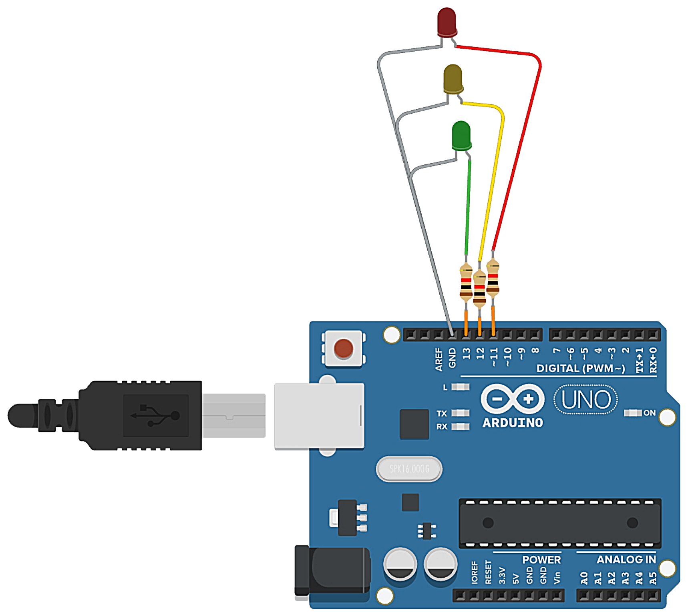

# Trafic Light with 3 (RED, YELLOW, GREEN) LED

> Program 

```ino
int
  R = 11,
  Y = 12,
  G = 13
;

void setup(){
  pinMode(R, OUTPUT);
  pinMode(Y, OUTPUT);
  pinMode(G, OUTPUT);
}

void loop(){
  signal(R, Y, G);
  signal(Y, R, G);
  signal(G, Y, R);
}

void signal(int on, int off1, int off2){
  digitalWrite(on, HIGH);
  digitalWrite(off1, LOW);
  digitalWrite(off2, LOW);
  delay(on==Y?2000:5000);
}
```

> Circuit


